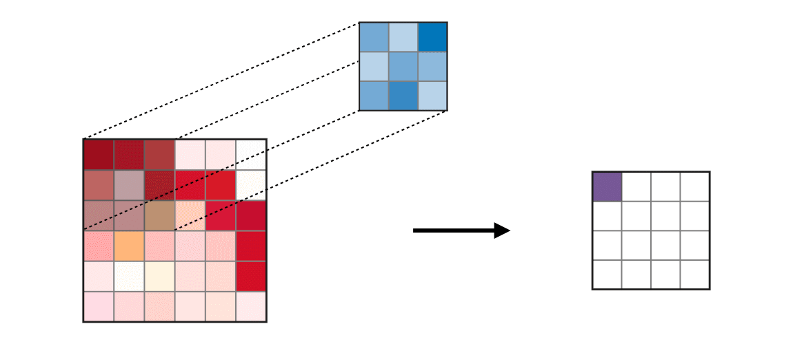
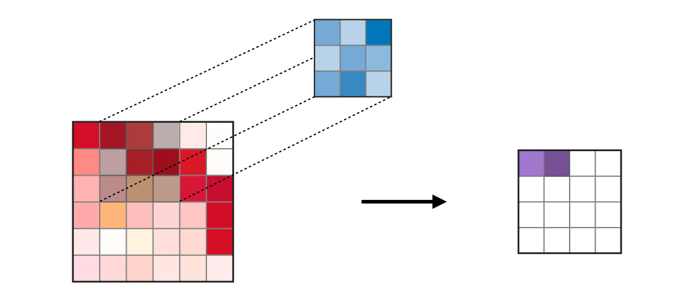
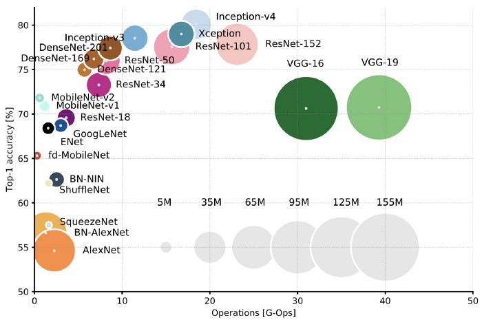

```{r setup, include=FALSE}
knitr::opts_chunk$set(echo = TRUE, cache = T, cache.lazy = FALSE) # notice cache=T here
knitr::opts_chunk$set(fig.height=4, fig.width=7, fig.align = 'center', warning = F)

if(!require('pacman')) {
  install.packages('pacman')
}
pacman::p_load(keras, ggplot2, imager, tidyverse)
```


\pagebreak

# Introduction {-}

Table of Contents

* Architecture: 
    + Convolutional layer
    + Pooling layer
* MNIST: Handwritten digit classification
* CIFAR10: Image classification

  
This lecture provides an introduction to Convolutional Neural Network. One of the most successful applications of deep learning is image recognition, we will explore the image-specialized Convolutional Neural Network (CNN) and see how it performs compared to the regular neural network on MNIST. The core of CNN is the convolutional layer and the pooling layer. Again this lecture only provides a high-level idea, lots of details are not covered. If you are interested to learn more in details, you can refer to this wonderful [Neural Networks course](http://cs231n.github.io). We will use some graphic illustrations from there.


# Neural Network

Let's remind ourselves of the classic neural network. Consider a classification problem. For each sample $(X_i, Y_i)$ where $i = 1, \ldots, n$, we have 

* $\mathbf X_i = (X_{i1}, \ldots, X_{ip})$ is a $p$-dimensional input features
* $\mathbf Y_i = (Y_{i1}, \ldots, Y_{iK})$ is a $K$-dimensional class indicator
    + for continuous response, $K=1$
    + for $K$-class classification, $Y_{ij} = 1$ if it is of class $j$ where $j = 1, \ldots, K$

We would like to build a classifier that is able to predict the class given the features. 

## Architecture

A neural network consists of three major layers: input layer, hidden layers and output layer. When we say $N$-layer neural network, we do not count the input layer as convention. A quick review on neural network using our simple example. Here is an example where there are three inputs, two outputs. We have one hidden layer with 4 neurons, relu activation is applied. 

```{r out.width = "500px", echo = F, fig.cap="1-layer Neural network model"}
knitr::include_graphics("img/nn.png")
```

For each data point $(x,y)$, 

* **Input layer** consists of 3 inputs units (3 features)
* **Hidden layer** consists of 4 neurons
    \[\boldsymbol{a^{(1)}} = f_1(W^{(1)} \boldsymbol{x} + \boldsymbol{b}^{(1)} )\]
where $\boldsymbol{a^{(1)}}$ is a 4-dimensional vector and $W^{(1)}$ is a $4\times 3$ matrix,$\boldsymbol{b}^{(1)}$ is a $4\times 1$ vector. $f_1$ is relu function.

* **Output layer** consists of 2 output units
    \[\boldsymbol{s} = W^{(2)} \boldsymbol{a^{(1)}} +\boldsymbol{b}^{(2)} \]
where $\boldsymbol{s}$ is a 2-dimensional vector and $W^{(2)}$ is a $ 2\times 4$ matrix, $\boldsymbol{b}^{(2)}$ is a  $2\times 1$ vector

* **Softmax**:
\[Prob(Y=1|\boldsymbol{x}) = \frac{e^{s_1}}{e^{s_1}+e^{s_2}} \]
\[Prob(Y=0|\boldsymbol{x}) = \frac{e^{s_2}}{e^{s_1}+e^{s_2}} \]

$W^{(1)}$, $\boldsymbol{b}^{(1)}$ and $W^{(2)}$, $\boldsymbol{b}^{(2)}$  are unknown parameters to be solved.


## Loss functions

The standard loss for classification is the **cross entropy**. Maximizing the likelihood is the same as minimizing the cross entropy. 

* **Softmax classifier**: one of the most popular choices. Denote the scores in the output layer as $(s_1, \ldots, s_K)$. Then the loss function is 
  $$L = - \frac{1}{n}\sum_{i=1}^n \log\Bigg(\frac{e^{s_{y_{ij}}}}{\sum_j e^{s_{ij}} } \Bigg)$$
  
  
# Convolutional Neural Network (CNN)

Convolutional neural network is similar to ordinary neural network but more specialized in images. The explicit assumption of image input allows the architecture to have specific properties for images to increase both accuracy and speed. 

The input for CNN is image. An image can be represented as a matrix of integers between 0 and 255. The scale of the integer represents the intensity of color. For a black and white image, one matrix is enough; for a colored image, we usually use 3 color channels RGB (red, green and blue) so we need 3 matrices to represent. For example, digit images in MNIST are of size 28x28x1, where 28 is the number of pixels and 1 is the color channel. Here is 1 because the images are in greyscale. For a colored image of 300x300, our input will be 300x300x3 with 3 being the number of color channels. 

Why the ordinary neural network does not work as well as CNN? Ordinary neural network does not take the positions of the pixels into consideration because we will vectorize the image before feeding forward to a neural network. However, we lost lots of information by vectorization without considering the pixels positions. In addition, the ordinary neural network does not scale well with images. Again if we have images of size 300x300x3, then we will have neurons with 300x300x3=270,000 weights for one fully-connected layer. If we want a deeper network then it scales up quickly. Intuitively, this huge number of parameters will end up overfitting. 

**3D Volumes of Neurons**
CNN takes advantage of the input being images and arranges neurons in 3 dimensions: width, height, and depth rather than vectorizing it. For example, for images in MNIST, the width and height of the input layer is the dimensions of the image with the depth to be 1. 

## Architecture overview

We use three main types of layers in CNN in addition to regular neural network: Convolutional Layer, Pooling Layer, and Fully-Connected Layer (as in regular neural network). One example of the CNN architecture for MNIST is

* **Input layer** [28x28x1] holds the original pixel values with width 28, height 28 with greyscale (1 color channel)
* **Convolutional layer** [28x28x6] will compute the output of neurons that are connected to the local regions of the **Input layer**. The dimensions of the local region is controlled by **filter**, which is basically weights. Usually, multiple filters will be applied. The depth of the convolutional layers is depends on how many filters we want to apply. The result is [28x28x6] if we use 6 filters. 
* **ReLU layer** [28x28x6] is the same as before. It applies the activation function.
* **Pooling layer** [14x14x6] downsampling along the spatial dimensions (width and height). 
* **Fully-connected layer** [1x1x10] computes the class scores for each digit. 

Let's look into the layers in details.

## Convolutional Layer

The most important thing is **filter**. A filter is a small matrix, so it is spatially small to capture local information. For instance, a filter can be of size 3x3x1 (3 pixels wide and high, and 1 because of the depth). Each element of the filter is some number. When we pass an image, i.e. a matrix, to a convolutional layer, we slide the filter along the width and height of the input, and compute the dot products between entries of the filter and the local input regions. The spatial arrangement remains unchanged. 

Take a 6x6 image as example, we use a 3x3 filter to convolute. We start from the 3x3 local region of the image at the topleft corner. We take the product of the corresponding elements in the local region and the filter then sum all the products. This reduces a 3x3 matrix into a number. We then take this number as the topleft element of the output. We can see this process as a weighted sum of the local region with the filter as the weights. This concludes the convolution process of the first local region.

```{r, echo = F, out.width="40%"}

```
We then move to the second step. The local region of interest is the 3x3 matrix right next to the previous local region. Similar to the first step, we take the weighted sum according to the same filter. The weighted sum become the second element of the output matrix. 


```{r, echo = F, out.width="40%"}

```

We slide this filter until we cover the whole image. We animate the whole process as follows.

```{r out.width = "350px", echo = F, fig.cap="Credit to CS 230"}
knitr::include_graphics("img/convolution-layer.png")
```

This is basically what the convolutional layer does. But what we will get after we convolute the original image? To see what filter actually do, let's take a 3x3 filter with all weights being 1 as example. This filter basically blur the image by blending with the pixels with its vicinity.
```{r}
image <- load.image('img/Untitled.png')
image <- image  %>%  grayscale() #Make grayscale and crop out white space
image.mat <- as.matrix(image)

tmp <- matrix(NA, nrow=26, ncol=26)
# apply ((1,1,1), (1,1,1), (1,1,1)) filter
for(i in 1:26) {
  for(j in 1:26)
    tmp[i,j] <- sum(image.mat[(i):(i+2),(j):(j+2)])
}
im.tmp <- as.cimg(tmp)
par(mfrow=c(1,2))
plot(image, main="original")
im.tmp %>% plot(main="filterd")
```

Another example is edge detector. Intuitively, edges appear where the immediate neighbors are different.
We can then take the difference between immediate neighbors to identify edges, i.e. a horizontal edge detector would be [1;-1] and a vertical edge detector would be [1,-1]. 
```{r}
image <- load.image('img/taj.jpg')
image <- image %>% autocrop() %>%  grayscale()
plot(image)

taj.mat <- as.matrix(image)
dim(taj.mat)  # Note how the dimension of the image is arranged
# vertical edge detector
taj.mat.v <- rbind(taj.mat[2:nrow(taj.mat),], 0)
tmp.v <- taj.mat - taj.mat.v
# horizontal edge detector
taj.mat.h <- cbind(taj.mat[,2:ncol(taj.mat)], 0)
tmp.h <- taj.mat - taj.mat.h

im.tmp.v <- as.cimg(tmp.v)
im.tmp.h <- as.cimg(tmp.h)

im.tmp.v %>% plot(main="Vertical edge detector")
im.tmp.h %>% plot(main="Horizontal edge detector")

```

Now that we have a basic understanding of how filters actually do, we should be able to understand what the convolutional layer does. Intuitively, CNN will learn what kind of filter to use to extract some type of visual feature such as the edges and color block. We usually apply multiple filters to extract different features and stack them to produce the output 3D volume. 

The next question is: what is the best filter? We train it as we train neural networks using the function `layer_conv_2d()` to add a convolutional layer. There are several tuning parameters.

* **size**: the dimension of the filter $W \times H \times C$ where $W$ is the width of the filer, $H$ is the height and $C$ is the number of channels.
* **depth**: we can apply multiple filters at the same local region of the input. For example, we can apply $K$ sequential filters.
* **stride**: controls how the filter slides. For example, when stride is 1, the filter moves one pixel at a time.
* **padding**: you might have noticed that if we apply filter then the dimension of the output will be shrunk. To keep/control the size of the output as the input, one way is to pad the input with zeros around the border. 

How many parameters we have now? Suppose all the $K$ filters are of the same dimension $W \times H \times C$. The total number of parameters are $(W \times H \times C)\times K$.

## Pooling Layer

The pooling layer is used to reduce the size of the 3D Volume so as to reduce the number of parameters and computation and thus to avoid overfitting. It uses an average filter or MAX filter to downsample. The stride is usually set as the same of width of the filters. The difference from the convolutional layer is that the pooling layer apply the filter on each depth slice so the depth of the output will remain the same as the input.


```{r out.width = "350px", echo = F, fig.cap="Credit to CS 230"}
knitr::include_graphics("img/max-pooling.png")
```

The function `layer_max_pooling_2d()` is for max pooling and `layer_average_pooling_2d()` to for average pooling. In the pooling layers, there is 0 parameters to learn. We specify the pooling function in the architecture.


## Fully Connected Layer

Now the convoluted images are still represented as a matrix. We need to vectorize (flatten) it before feed forwarding to our usual neural network.


```{r out.width = "350px", echo = F, fig.cap="Credit to CS 230"}
knitr::include_graphics("img/fully-connected.png")
```

These are all the basic elements for CNN! People then get creative on each layer and depth of the network to create different architecture/models with more and more parameters!

```{r out.width = "500px", echo = F, fig.cap="https://arxiv.org/pdf/1605.07678.pdf"}

```


> Top-1 one-crop accuracy versus amount of operations required for a single forward pass. The size of the blobs is proportional to the number of network parameters; a legend is reported in the bottom right corner, spanning from 5×106 to 155×106 params.

# MNIST Again

Let's apply CNN to MNIST and see whether it performs better than the regular neural network. 

```{r}
mnist <- dataset_mnist()
c(c(train_images, train_labels), c(test_images, test_labels)) %<-% mnist
```

As CNN expects the input as images, we need to transform the data into a 3D Volume.

```{r}
# layer_conv_2d() expects a 3D volume (number of samples, width, height, color channels)
train_images <- array_reshape(train_images, c(60000, 28, 28, 1)) 
train_images <- train_images / 255

## Reshape the data
test_images <- array_reshape(test_images, c(10000, 28, 28, 1))
test_images <- test_images / 255

## Vectorize the labels
train_labels <- to_categorical(train_labels)
test_labels <- to_categorical(test_labels)
```

Now specify the CNN architecture. 

```{r}
# Initialize sequential model
model <- keras_model_sequential() %>%
 
  # Start with hidden 2D convolutional layer being fed 32x32 pixel images
  layer_conv_2d(
    filter = 32, kernel_size = c(3,3), padding = "same", 
    input_shape = c(28, 28, 1)
  ) %>%
  layer_activation("relu") %>%

  # Second hidden layer
  layer_conv_2d(filter = 32, kernel_size = c(3,3)) %>%
  layer_activation("relu") %>%

  # Use max pooling
  layer_max_pooling_2d(pool_size = c(2,2)) %>%
  layer_dropout(0.25) %>%
  
  # Flatten max filtered output into feature vector 
  # and feed into dense layer
  layer_flatten() %>%
  layer_dense(512) %>%
  layer_activation("relu") %>%
  layer_dropout(0.5) %>%

  # Outputs from dense layer are projected onto 10 unit output layer
  layer_dense(10) %>%
  layer_activation("softmax")

# opt <- optimizer_rmsprop(lr = 0.0001, decay = 1e-6)

model %>% compile(
  loss = "categorical_crossentropy",
  optimizer = "rmsprop",
  metrics = "accuracy"
)
```

```{r}
# load if the model is saved
model_loaded <- tryCatch(load_model_tf("MNIST_CNN"),
                         error = function(msg) { print("No saved model."); return(NULL) })

# else fit the model using same setting to make a relatively fair comparison
if(is.null(model_loaded)) {
  model %>% fit(
    train_images, train_labels, epochs = 5, batch_size = 128, validation_split = 0.2
  )
  save_model_tf(object = model, filepath = "MNIST_CNN")
} else {
  model <- model_loaded
}
```

Lets see how we perform on the test data:
```{r}
results <- model %>% evaluate(test_images, test_labels)
results
```

This CNN model has a even better prediction power with an accuracy of 99\%  on the testing set. (It has more layers though!)

# CIFAR10

The CIFAR10 dataset contains 60,000 color images in 10 classes, with 6,000 images in each class. The dataset is divided into 50,000 training images and 10,000 testing images. Each image is of size 32 by 32 and has 3 color channels.

```{r}
cifar <- dataset_cifar10()
```

Let's take a look at the first 30 images.
```{r}
class_names <- c('airplane', 'automobile', 'bird', 'cat', 'deer',
               'dog', 'frog', 'horse', 'ship', 'truck')

index <- 1:30

par(mfcol = c(5,6), mar = rep(1, 4), oma = rep(0.2, 4))
cifar$train$x[index,,,] %>% 
  purrr::array_tree(1) %>%
  purrr::set_names(class_names[cifar$train$y[index] + 1]) %>% 
  purrr::map(as.raster, max = 255) %>%
  purrr::iwalk(~{plot(.x); title(.y)})
```

```{r}
model <- keras_model_sequential() %>% 
  layer_conv_2d(filters = 32, kernel_size = c(3,3), activation = "relu", 
                input_shape = c(32,32,3)) %>% 
  layer_max_pooling_2d(pool_size = c(2,2)) %>% 
  layer_conv_2d(filters = 64, kernel_size = c(3,3), activation = "relu") %>% 
  layer_max_pooling_2d(pool_size = c(2,2)) %>% 
  layer_conv_2d(filters = 64, kernel_size = c(3,3), activation = "relu") %>% 
  layer_flatten() %>% 
  layer_dense(units = 64, activation = "relu") %>% 
  layer_dense(units = 10, activation = "softmax")

summary(model)
```
```{r}
model %>% compile(
  optimizer = "adam",
  loss = "sparse_categorical_crossentropy",
  metrics = "accuracy"
)

history <- model %>% 
  fit(
    x = cifar$train$x, y = cifar$train$y,
    epochs = 10,
    validation_data = unname(cifar$test),
    verbose = 2
  )

plot(history)
```

Let's evaluate our model on the testing set.
```{r}
model_eval <- evaluate(model, cifar$test$x, cifar$test$y, verbose = 0)
model_eval
```
We got `r scales::percent(model_eval[2])`  accuracy. Not too bad considering this is a simple model!

# Conclusion

We learnt about the basic elements of CNN and how convolutional neural network is designed for images with the convolutional layers and pooling layers.
Using the `keras` package, we apply CNN to MNIST again and obtain an even higher accuracy than a simple neural network. We also try a harder task with the CIFAR10 data to classify 10 classes of images.

# Additional References

[UPenn CIS 545: Big Data Analytics, Module 20](https://sites.google.com/seas.upenn.edu/cis545/home)

[Stanford CS 230: Deep Learning](https://stanford.edu/~shervine/teaching/cs-230/cheatsheet-convolutional-neural-networks) 

