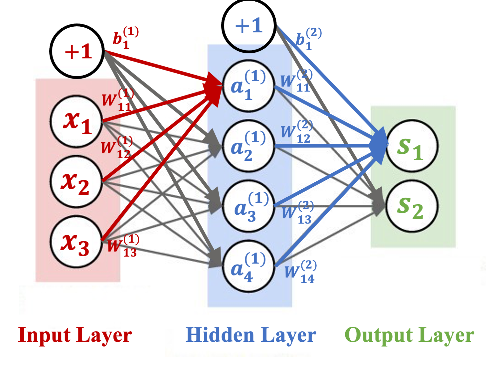

```{r setup, include=FALSE}
knitr::opts_chunk$set(echo = TRUE, fig.width=8, fig.height=4)
options(scipen = 0, digits = 3)  # controls base R output
if(!require('pacman')) {
  install.packages('pacman')
}
pacman::p_load(ggplot2, dplyr, tidyverse, gridExtra, ggrepel, plotly, skimr) 
# install a package if it does not exist already and put the package in the path (library)
# dplyr, ggplot2,tidyr
```

### Objectives

Neural network borrows the idea of cognitive science and models the behavior of neurons so as to mimic the perception process of human being. It has many successful applications especially in image recognition and natural language processing. 

We will learn about the components of a neural network model and apply neural network to the Yelp review classification problem and a digit recognition problem.

# Neural network

In this section, we will learn about the basic components of a neural network.

- Architecture
  - Input layer
  - Hidden layer
  - Output layer

- Loss function

### Setup

Let's consider a classification problem. For each sample $(X_i, Y_i)$ where $i = 1, \ldots, n$, we have 

* $\mathbf X_i = (X_{i1}, \ldots, X_{ip})$ is a $p$-dimensional input features
* $\mathbf Y_i = (Y_{i1}, \ldots, Y_{iK})$ is a $K$-dimensional class indicator
    + for continuous response, $K=1$
    + for $K$-class classification, $Y_{ij} = 1$ if it is of class $j$ where $j = 1, \ldots, K$

Given the features/predictors, we would like to build a probability model for y (categorical). We then can predict y accordingly. Or build a predictive equation for a continuous response y. 


### Prelude: logistic regression

For example, we have 3 covariates $(x_1, x_2, x_3)$ and a label $y \in \{0,1\}$. We model probability of $P(y=1|x_1, x_2, x_3)$ through a linear logit link function: 

\[logit(Prob(Y=1 | X_1, X_2, X_3)) = \beta_0 + \beta_1 X_1 +  \beta_2 X_2 +  \beta_3 X_3  \]

Or equivalently this is same to model 
\[Prob(Y=1 | X_1, X_2, X_3) = \frac{e^{\beta_0 + \beta_1 X_1 +  \beta_2 X_2 +  \beta_3 X_3}}
{1+ e^{\beta_0 + \beta_1 X_1 +  \beta_2 X_2 +  \beta_3 X_3}}\]


### Architecture: logistic regression

Let us rephrase the model process in the following neural network with only an input layer and an output layer.

* **Input layer** consists of 3 inputs units (3 features): $x_1, x_2, x_3$
* **Output layer**: contains $s_1, s_2$:
  \[s_1 = b_{1}^{(1)} + W_{11}^{(1)}x_1 + W_{12}^{(1)}x_2 + W_{13}^{(1)}x_3\]
    \[s_2 = b_{2}^{(1)} + W_{21}^{(1)}x_1 + W_{22}^{(1)}x_2 + W_{23}^{(1)}x_3\]
* **Softmax**: models:
\[Prob(Y=1|x_1, x_2, x_3) = \frac{e^{s_1}}{e^{s_1}+e^{s_2}}\]
\[Prob(Y=0|x_1, x_2, x_3) = \frac{e^{s_2}}{e^{s_1}+e^{s_2}} \]
   
### Architecture: logistic regression

\begin{figure}
\includegraphics[width=.8\textwidth]{img/logit.png}
\caption{Logistic regression as 0-layer neural network}
\end{figure}

### Architecture: logistic regression

**The above classical logistic regression model is a simple network:**

\begin{columns}
  \column{0.38\linewidth}
     \centering
     \includegraphics[width=\linewidth]{img/logit.png}
   \column{0.58\linewidth}

\begin{itemize}
\item 0 layer

\item softmax as output (meaning logit function)

\item classification is done through thresholding the probability

\item it is simple and we can interpret the probability model

\item BUT, it is restrictive for the model format. 
\end{itemize}

 \end{columns}


### Architecture

As a simple example, consider the setup: we have $(x_1, x_2, x_3, y)$, where there are 3 features and one binary response. Let's start with the following neural network with **one hidden layer** with one hidden layer consists of **4 neurons**. We have 3 features for each data point and 2 classes to predict. 

```{r out.width = "\\textwidth", echo = F, fig.cap="1-layer Neural network model"}

```

### Architecture

For each data point $(x,y)$, 

* **Input layer** consists of **3 inputs** units (3 features): $x_1, x_2, x_3$
* **Hidden layer** consists of **4 neurons**. Each neuron is given by first taking a linear combination then apply an **activation** function $f_1$
    \[a_1^{(1)} = f_1(b_{1}^{(1)} + W_{11}^{(1)}x_1 + W_{12}^{(1)}x_2 + W_{13}^{(1)}x_3)\]
    \[a_2^{(1)} = f_1(b_{2}^{(1)} + W_{21}^{(1)}x_1 + W_{22}^{(1)}x_2 + W_{23}^{(1)}x_3)\]
    \[a_3^{(1)} = f_1(b_{3}^{(1)} + W_{31}^{(1)}x_1 + W_{32}^{(1)}x_2 + W_{33}^{(1)}x_3)\]
    \[a_4^{(1)} = f_1(b_{4}^{(1)} + W_{41}^{(1)}x_1 + W_{42}^{(1)}x_2 + W_{43}^{(1)}x_3)\]
where $a_i^{(1)}$ denotes the $i$-th activated neuron in hidden layer 1.  
* $f_1(x)$ is called an activation function. Here we take **ReLU** function:
\[f_1(x) = \max (0, x) \]

* **Output layer** consists of 2 output units
    \[s_1 = b_{1}^{(2)}+W_{11}^{(2)}a_1^{(1)} + W_{12}^{(1)}a_2^{(1)} + W_{13}^{(1)}a_3^{(1)} + W_{14}^{(1)}a_4^{(1)}\]
    \[s_2 = b_{2}^{(2)}W_{21}^{(2)}a_1^{(1)} + W_{22}^{(1)}a_2^{(1)} + W_{23}^{(1)}a_3^{(1)} + W_{24}^{(1)}a_4^{(1)}\]
   
* **Softmax**: models:
\[Prob(Y=1|x_1, x_2, x_3) = \frac{e^{s_1}}{e^{s_1}+e^{s_2}} = \frac{e^{b_{1}^{(2)}+W_{11}^{(2)a_1^{(1)} + W_{12}^{(1)}a_2^{(1)} + W_{13}^{(1)}a_3^{(1)} + W_{14}^{(1)}a_4^{(1)}} }}{e^{s_1}+e^{s_2}}\]
\[Prob(Y=0|x_1, x_2, x_3) = \frac{e^{s_2}}{e^{s_1}+e^{s_2}}=\frac{e^{ b_{2}^{(2)}W_{21}^{(2)}a_1^{(1)} + W_{22}^{(1)}a_2^{(1)} + W_{23}^{(1)}a_3^{(1)} + W_{24}^{(1)}a_4^{(1)}} }{e^{s_1}+e^{s_2}} \]


### Pipeline functions
\footnotesize
```{r, eval = F}
X_train; y_train; X_test; y_test
p <- ncol(X_train) # number of input variables

## Build model
model <- keras_model_sequential() %>%
  layer_dense(units = 16, activation = "relu", input_shape = c(p)) %>% 
  # layer with 8 neurons
  layer_dense(units = 2, activation = "softmax") # output


## Compile the Model
model %>% compile(
  optimizer = "rmsprop",
  loss = "sparse_categorical_crossentropy",
  metrics = c("accuracy")
)
```

### Pipeline functions
\footnotesize
```{r, eval = F}
## Fit the model
fit1 <- model %>% fit(
  X_train,
  y_train,
  epochs = 20,
  batch_size = 512,
  # set 15% of the data3_xtain, data3_ytrain as the validation data
  validation_split = .15  
)

## Evaluate fit
results <- model %>% evaluate(X_test, y_test)

## Prediction
pred.prob <- model %>% predict(X_test)

y.pred <- model %>% predict_classes(X_test)  # majority vote!

```

